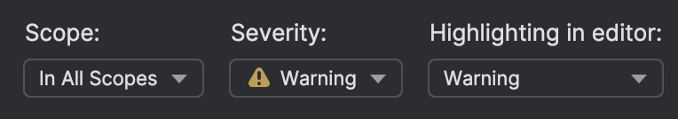
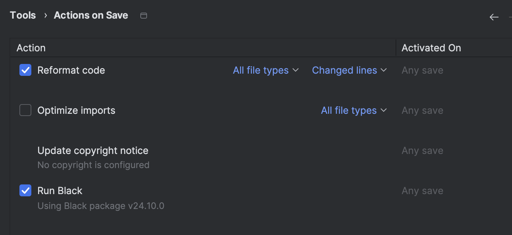
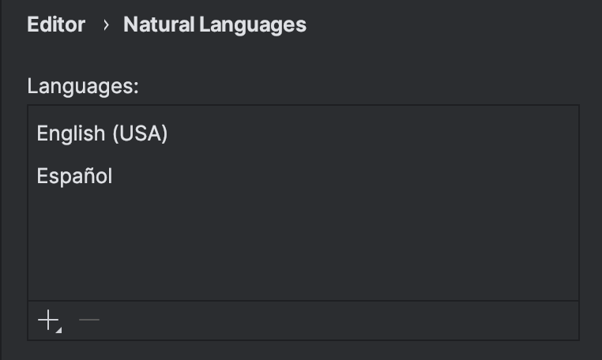

# Modulo 1 : Orientación al Perfil y Metodología del Curso

## Clase 1

En esta clase instalaremos los requerimientos de software para el desarrollo de los ejercicios en el resto del curso.


### Requerimientos:

- **Python 3.12**: esta es la versión recomendada, si tienes una inferior y la estás usando puedes mantenerla, si no la has usado aún aprovecha de actualizarla. Asegurate de descargar la versión adecuada a tu sistema operativo y arquitectura de procesador [link descarga](https://www.python.org/downloads/release/python-3127/)

- **IDE de desarrollo PyCharm Community Edition**: Esta es la versión gratuita, asegurate de seleccionar la versión Community que se encuentra al final de la [página de descarga](https://www.jetbrains.com/es-es/pycharm/download/?section=windows)

- Github: Adicionalmente necesitarás crearte una cuenta en este servicio [crear aquí](https://github.com/signup)


### Alternativas y adicionales

- **vscode**: Alternativamente puedes usar vscode, un editor extendible con muchas extensiones, lo debes descargar desde su [página oficial](https://code.visualstudio.com/)
    - Las extensiones requeridas para Python son: 
        - [python](https://marketplace.visualstudio.com/items?itemName=ms-python.python)
        - [debugger](https://marketplace.visualstudio.com/items?itemName=ms-python.debugpy)
        - [pylance](https://marketplace.visualstudio.com/items?itemName=ms-python.vscode-pylance)

- **Cliente Github**: Podrás utilizar github directamente desde PyCharm/vscode o desde la aplicación oficial de Github, esta última es recomendable para familiarizarse con el uso de Github, ya que su uso es muy intuitivo, [link descarga](https://desktop.github.com/download/)

### Configuración de Pycharm

### Activar inspección de PEP8

Para activar el soporte integrado de PEP8, debes seguir los siguientes pasos:

1. Abrir las preferencias
    ```
    •	En macOS: PyCharm > Settings
    •	En Windows/Linux: File > Settings
    ```
2. Activar el inspector PEP8
    ```
   Editor > Inspection
   Seleccionar 
    ```
   ]
3. Configuración para mostrar warnings:
    
4. Puedes activar el formateo al guardar mediante black mediante la siguiente configuración:
   
   
5. Finalmente puedes agregar el diccionario del idioma en que programes para el resaltado de `typos`
   