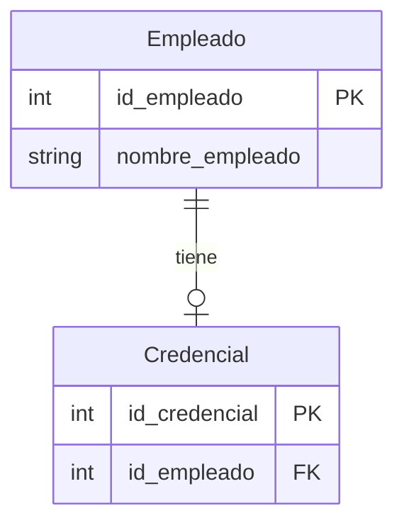
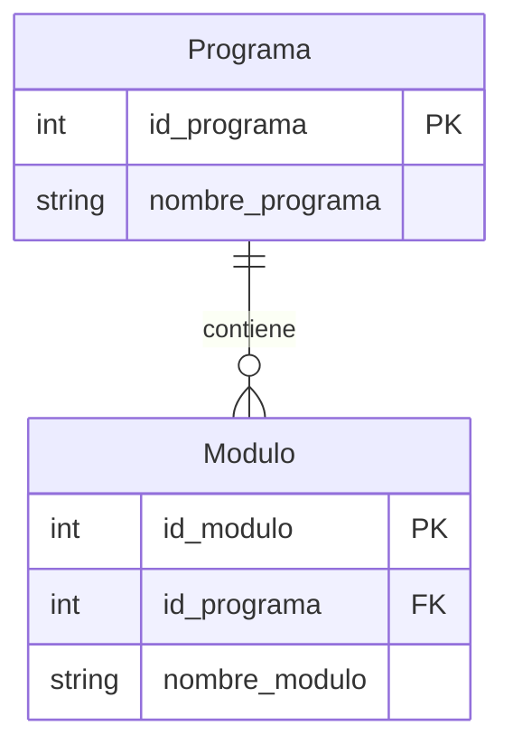
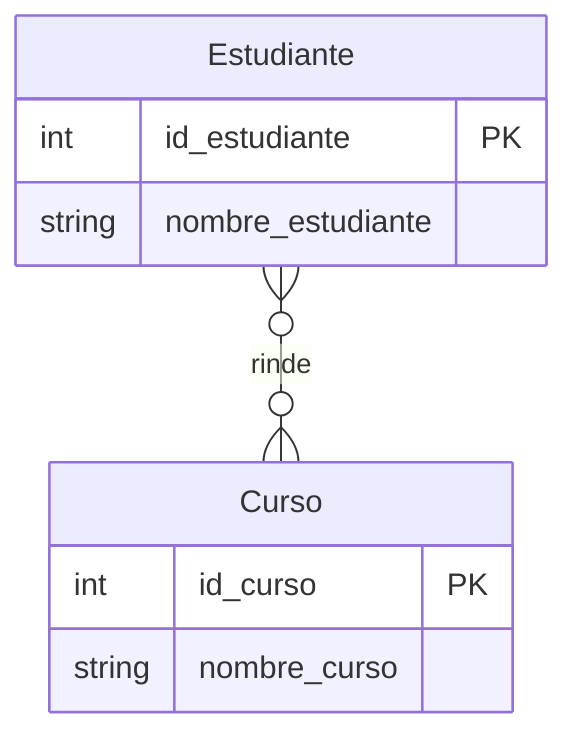
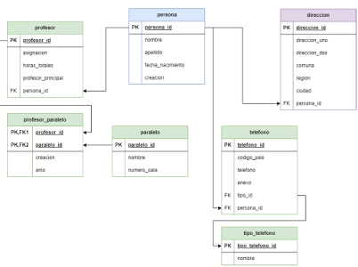

## Clase 2: Introducción a PostgreSQL Parte 2

### Relaciones

#### Claves

Las claves son los datos que identifican de manera única a cada registro en una tabla.

Las claves pueden ser:

- Clave primaria: es la clave que identifica de manera única a cada registro en una tabla.
- Clave foránea: es la clave que referencia a la clave primaria de otra tabla.

Para definir una clave primaria, se utiliza la palabra clave `PRIMARY KEY` de la siguiente manera:

```sql
CREATE TABLE profesor (
    id_profesor serial primary key,
    nombre varchar(50),
    apellido varchar(50),
    email varchar(50),
    telefono varchar(50)
);
```

Para definir una clave foránea, se utiliza la palabra clave `FOREIGN KEY (...) REFERENCES` de la siguiente manera:

```sql
CREATE TABLE curso (
    id_curso serial primary key,
    id_profesor int references profesor(id_profesor),
    nombre varchar(50),
    descripcion varchar(50)
);
```

Podemos establecer las relaciones de las tablas posterior a su creación, para ello se utiliza la palabra clave `ALTER TABLE` de la siguiente manera:

```sql
ALTER TABLE curso 
ADD CONSTRAINT fk_profesor FOREIGN KEY (id_profesor) REFERENCES profesor(id_profesor);
```

#### Relaciones

Las relaciones son las conexiones que se establecen entre las tablas.

Existen 3 tipos de relaciones:

- 1:1
- 1:N
- N:M


#### Relación 1:1 Uno a uno

En este caso un registro de una tabla puede estar relacionado con un único registro de otra tabla.

```sql
CREATE TABLE empleado (
    id_empleado serial primary key,
    nombre_empleado varchar(50) NOT NULL
);

CREATE TABLE credencial (
    id_credencial serial primary key,
    id_empleado int unique not null,
    FOREIGN KEY (id_empleado) REFERENCES empleado(id_empleado)
);
```

El diagrama de entidad relación, siguiendo la notación de Mermaid se vería de la siguiente manera:



#### Relación 1:N Uno a muchos

En este caso un registro de una tabla puede estar relacionado con varios registros de otra tabla.

```sql
CREATE TABLE programa (
    id_programa serial primary key,
    nombre_programa varchar(50) NOT NULL
);

CREATE TABLE modulo (
    id_modulo serial primary key,
    id_programa int not null,
    nombre_modulo varchar(50) NOT NULL,
    FOREIGN KEY (id_programa) REFERENCES programa(id_programa)
);
```



#### Relación N:M Muchos a muchos

En este caso un registro de una tabla puede estar relacionado con varios registros de otra tabla y viceversa.

```sql
CREATE TABLE estudiante (
    id_estudiante serial primary key,
    nombre_estudiante varchar(50) NOT NULL
);

CREATE TABLE curso (
    id_curso serial primary key,
    nombre_curso varchar(50) NOT NULL
);

CREATE TABLE estudiante_curso (
    id_estudiante int not null,
    id_curso int not null,
    PRIMARY KEY (id_estudiante, id_curso),
    FOREIGN KEY (id_estudiante) REFERENCES estudiante(id_estudiante),
    FOREIGN KEY (id_curso) REFERENCES curso(id_curso)
);
```



### JOINS

JOIN nos permite combinar registros de dos o más tablas basándonos en una condición.

Existen 4 tipos de JOIN:

- INNER JOIN
- LEFT JOIN
- RIGHT JOIN
- FULL JOIN

Usando estas tablas de ejemplo:

```sql
CREATE TABLE empleado (
    id_empleado serial primary key,
    nombre_empleado varchar(50) NOT NULL
);

CREATE TABLE credencial (
    id_credencial serial primary key,
    id_empleado int,
    FOREIGN KEY (id_empleado) REFERENCES empleado(id_empleado)
);
```

#### INNER JOIN

INNER JOIN nos permite combinar registros de dos o más tablas basándonos en una condición. Nos devuelve los registros que tienen una relación entre las tablas.

ejemplo:

```sql
SELECT * 
FROM empleado 
INNER JOIN credencial ON empleado.id_empleado = credencial.id_empleado;
```

#### LEFT JOIN

LEFT JOIN nos permite combinar registros de dos o más tablas basándonos en una condición. Nos devuelve TODOS los registros de la tabla izquierda y los registros de la tabla derecha que tengan una relación.

ejemplo:

```sql
SELECT * 
FROM empleado 
LEFT JOIN credencial ON empleado.id_empleado = credencial.id_empleado;
```

#### RIGHT JOIN

RIGHT JOIN nos permite combinar registros de dos o más tablas basándonos en una condición. Nos devuelve TODOS los registros de la tabla derecha y los registros de la tabla izquierda que tengan una relación.

ejemplo:

```sql
SELECT * 
FROM empleado 
RIGHT JOIN credencial ON empleado.id_empleado = credencial.id_empleado;
```

#### FULL OUTER JOIN

FULL OUTER JOIN nos permite combinar registros de dos o más tablas basándonos en una condición. Nos devuelve TODOS los registros de las tablas izquierda y derecha.

ejemplo:

```sql
SELECT * 
FROM empleado 
FULL OUTER JOIN credencial ON empleado.id_empleado = credencial.id_empleado;
```

#### Ejemplo

Tabla Empleado

| id_empleado | nombre_empleado |
|-------------|-----------------|
| 1           | Juan Perez      |
| 2           | Maria Gomez     |
| 3           | Pedro Rodriguez|

Tabla Credencial, no todos tienen credencial

| id_credencial | id_empleado | numero_credencial |
|---------------|-------------|-------------------|
| 1             | 1           | 1234567890        |
| 2             | 2           | 1234567891        |
| 3             |             | 1234567892        |

Resultado INNER JOIN, no incluye los empleados que no tienen credencial

```sql
SELECT * 
FROM empleado 
INNER JOIN credencial ON empleado.id_empleado = credencial.id_empleado;
``` 

| id_empleado | nombre_empleado | id_credencial | numero_credencial |
|-------------|-----------------|---------------|-------------------|
| 1           | Juan Perez      | 1             | 1234567890        |
| 2           | Maria Gomez     | 2             | 1234567891        |

LEFT JOIN, incluye los empleados que no tienen credencial

```sql
SELECT * 
FROM empleado 
LEFT JOIN credencial ON empleado.id_empleado = credencial.id_empleado;
```

| id_empleado | nombre_empleado | id_credencial | numero_credencial |
|-------------|-----------------|---------------|-------------------|
| 1           | Juan Perez      | 1             | 1234567890        |
| 2           | Maria Gomez     | 2             | 1234567891        |
| 3           | Pedro Rodriguez |               |                   |

RIGHT JOIN, incluye las credenciales que no tienen empleado

```sql
SELECT * 
FROM empleado 
RIGHT JOIN credencial ON empleado.id_empleado = credencial.id_empleado;
```

| id_empleado | nombre_empleado | id_credencial | numero_credencial |
|-------------|-----------------|---------------|-------------------|
| 1           | Juan Perez      | 1             | 1234567890        |
| 2           | Maria Gomez     | 2             | 1234567891        |
|             |                 | 3             | 1234567892        |

FULL OUTER JOIN, incluye todos los registros de las tablas izquierda y derecha

```sql
SELECT * 
FROM empleado 
FULL OUTER JOIN credencial ON empleado.id_empleado = credencial.id_empleado;
```

| id_empleado | nombre_empleado | id_credencial | numero_credencial |
|-------------|-----------------|---------------|-------------------|
| 1           | Juan Perez      | 1             | 1234567890        |
| 2           | Maria Gomez     | 2             | 1234567891        |
| 3           | Pedro Rodriguez |               |                   |
|             |                 | 3             | 1234567892        |


## Ejercicio A: Relaciones

Siga el siguiente diagrama y desarróllelo en SQL.



## Solución

* [solución](ejercicio-bloque-a.sql)

## Ejercicio B: JOINS y Consultas

Basados en el resultado del ejercicio anterior.

1. Agregue al menos 3 registros para cada tabla, considerando las relaciones. 
2. Obtenga lo siguiente: 
    1. Direcciones por personas.
    2. Teléfonos por personas. 
    3. Profesores por paralelos. 
    4. Información por profesor (nombre, apellido, teléfonos, y direcciones). 
    5. Información de paralelos de profesores, consideración todos los datos de cada persona. 

## Solución

* [solución](ejercicio-bloque-b.sql)

