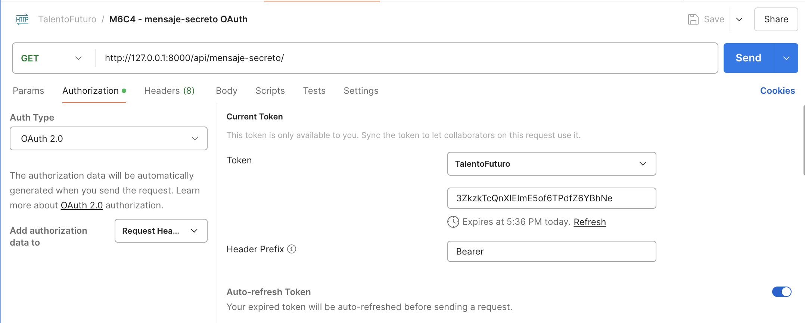

## Clase 2: Autenticación con OAuth

## Autenticación con OAuth 2.0

### Cliente OAuth2 manual

En este ejemplo vamos a utilizar  una libreria para manejar el flujo de OAuth2 de GitHub, para ello primero instalamos la libreria:

```bash
pip install requests-oauthlib
```

Utilizaremos también la libreria `python-dotenv` para cargar las variables de entorno desde el archivo `.env`:

```bash
pip install python-dotenv
```

En el archivo `.env` se debe agregar las variables de entorno, debemos obtener el `Client ID` y el `Client Secret` desde [GitHub](https://github.com/settings/developers) desde nuestra aplicación (las instrucciones para crear una aplicación en GitHub se encuentran en las slides de la clase):

```bash
GITHUB_CLIENT_ID="tu_client_id"
GITHUB_CLIENT_SECRET="tu_client_secret"
```

Podemos seguir los siguientes pasos desde la shell de python o ejecutar el archivo `cliente_oauth.py`:

* Mediante dotenv se cargan las variables de entorno:
  ```bash
  from dotenv import load_dotenv
  load_dotenv()
  ```
* Utilizamos la librería `requests-oauthlib` para realizar la autenticación con OAuth2.0, indicando el cliente id y el cliente secret, además de la url de autorización y el token:
  ```bash
  from requests_oauthlib import OAuth2Session

  GITHUB_CLIENT_ID = os.getenv("GITHUB_CLIENT_ID")
  GITHUB_CLIENT_SECRET = os.getenv("GITHUB_CLIENT_SECRET")

  authorization_base_url = "https://github.com/login/oauth/authorize"
  token_url = "https://github.com/login/oauth/access_token"

  client = OAuth2Session(GITHUB_CLIENT_ID)
  auth_url, state = client.authorization_url(authorization_base_url)
  print("Vista la siguiente url y autoriza", auth_url)
  ```
* Una vez que ingresamos a la url, se nos redirige a una url de callback la cual copiaremos y pegaremos en el siguiente input:
  ```bash
  uri = input("Enter the URI: ")
  client.fetch_token(
      token_url, client_secret=GITHUB_CLIENT_SECRET, authorization_response=uri
  )
  ```
* Luego de esto tendremos una session de requests con el token, el cual podemos utilizar para hacer requests a la API:
  ```bash
  response = client.get("https://api.github.com/user")
  print(response.json())
  ```

## Cliente de OAuth2 en Django

En este ejemplo vamos a utilizar la libreria `social-auth-app-django` para manejar el flujo de OAuth2 de GitHub, para ello primero instalamos la libreria:

```bash
pip install social-auth-app-django
```

Creación del proyecto y la app:

```bash
django-admin startproject miapi
cd miapi
django-admin startapp autenticacion
```

Agregar `'social_django',` en `INSTALLED_APPS` en `settings.py`:

```python
# miapi/settings.py
INSTALLED_APPS = [
    ...
    'social_django',
]
...
AUTHENTICATION_BACKENDS = [
    "social_core.backends.github.GithubOAuth2",
    "django.contrib.auth.backends.ModelBackend",
]
# id y secret de la aplicación de GitHub
SOCIAL_AUTH_GITHUB_KEY = os.getenv("GITHUB_CLIENT_ID")
SOCIAL_AUTH_GITHUB_SECRET = os.getenv("GITHUB_CLIENT_SECRET")
# url a la que se redirige al usuario luego de iniciar sesión
SOCIAL_AUTH_LOGIN_REDIRECT_URL = "/profile/"
SOCIAL_AUTH_NEW_USER_REDIRECT_URL = "/profile/"
#  siempre confirma con el usuario durante el login y solicita los permisos de email
SOCIAL_AUTH_GITHUB_SCOPE = ["user:email"]
SOCIAL_AUTH_GITHUB_AUTH_EXTRA_ARGUMENTS = {
    "prompt": "consent",
}
```

Correr migraciones:

```bash
python manage.py migrate
```

Para poder probar facilmente el cliente de OAuth2 en Django, vamos a implementar vistas para iniciar sesión y visualizar el perfil del usuario, 
estas se pueden encontrar en el archivo `miapi/autenticacion/views.py` de la app `autenticacion`.

```python
autenticacion/views.py
from django.contrib.auth import logout as django_logout
from django.shortcuts import redirect, render


# Create your views here.
def home(request):
    return render(request, "home.html")


def profile(request):
    oauth2_data = request.user.social_auth.get(provider="github")
    return render(request, "profile.html", {"oauth2_data": oauth2_data})
```

Finalmente, agregamos las urls en `urls.py`:

```python
# miapi/urls.py
from autenticacion import views
from django.contrib import admin
from django.contrib.auth.views import LogoutView
from django.urls import include, path

urlpatterns = [
    path("admin/", admin.site.urls),
    path("auth/", include("social_django.urls", namespace="social")),
    path("", views.home, name="home"),
    path("profile/", views.profile, name="profile"),
    path("logout/", LogoutView.as_view(next_page="home"), name="logout"),
]
```

Por simplicidad no mostramos los templates, pero se pueden encontrar en el repositorio en el directorio [templates](./api/autenticacion/templates)

## Servidor de OAuth2

Implementaremos un servidor de OAuth2 para poder utilizarlo en nuestras APIs, para ello utilizaremos [Django OAuth Toolkit](https://django-oauth-toolkit.readthedocs.io/en/latest/).

Instalamos las dependencias:

```bash
pip install django-oauth-toolkit
```

Crearemos un proyecto nuevo para el servidor de OAuth2:

```bash
django-admin startproject oauth2
cd oauth2
django-admin startapp autenticacion
```

Configuramos el servidor de OAuth2 en `settings.py`:

```python
# oauth2/settings.py
INSTALLED_APPS = [
  ...
  "rest_framework",
  "oauth2_provider",
  "autenticacion",
]
REST_FRAMEWORK = {
  "DEFAULT_AUTHENTICATION_CLASSES": [
    "oauth2_provider.contrib.rest_framework.OAuth2Authentication",
  ],
  "DEFAULT_PERMISSION_CLASSES": [
    "rest_framework.permissions.IsAuthenticated",
  ],
}
OAUTH2_PROVIDER = {
  'ACCESS_TOKEN_EXPIRE_SECONDS': 3600, # 1 hora
  'REFRESH_TOKEN_EXPIRE_SECONDS': 3600 * 24 * 30, # 30 días
  "AUTHORIZATION_CODE_EXPIRE_SECONDS": 600, # 10 minutos
  "SCOPES": {
    "read": "Read access",
    "write": "Write access",
  },
}
LOGIN_URL = '/admin/login/'
```

Y configuramos las urls en `urls.py`:

```python
# oauth2/urls.py
from autenticacion.views import AdminOnlyView, MensajeSecretoView
from django.contrib import admin
from django.urls import include, path
from oauth2_provider import urls as oauth2_urls

urlpatterns = [
    path("admin/", admin.site.urls),
    path("o/", include(oauth2_urls)),
    # nuestros endpoints
    path("api/mensaje-secreto/", MensajeSecretoView.as_view(), name="mensaje_secreto"),
    path("api/admin-only/", AdminOnlyView.as_view(), name="admin_only"),
]
```

Corremos las migraciones y creamos un superusuario:

```bash
python manage.py migrate
python manage.py createsuperuser
```

Una vez creado el superusuario, podemos registrar una nueva aplicación en el servidor de OAuth2 visitando la url `http://localhost:8000/admin/oauth2_provider/application/add/` y completando los campos:

* Client type: Confidential
* Authorization grant type: Authorization code
* Redirect uris: https://oauth.pstmn.io/v1/callback ya que utilizaremos Postman para probar el servidor de OAuth2
* Hash Client Secret: True
* Algorithm: No OIDC Support

Debemos asegurarnos de copiar el `Client ID` y el `Client Secret` para utilizarlos en nuestras pruebas.



Configuramos además la configuración de Postman para utilizar el `Client ID` y el `Client Secret` en las solicitudes, como muestra la imagen:


Debemos asegurarnos de configurar además correctamente:
* grant type: Authorization Code with PKCE
* callback url: https://oauth.pstmn.io/v1/callback
* authorize using browser: True
* auth url: http://localhost:8000/o/authorize/
* access token url: http://localhost:8000/o/token/
* client id: los copiados desde nuestra aplicación en el servidor de OAuth2
* client secret: los copiados desde nuestra aplicación en el servidor de OAuth2
* code challenge method: S256
* code verifier: dejar en blanco
* scope: read
* state: dejar en blanco
* client authentication: Send as Basic Auth header


## Ejercicio A: Agregando autenticación a nuestras APIs

* En las últimas clases antes del receso, estuvimos diseñando algunos endpoints para manejo de bibliotecas (libros, reviews).
* Ahora, los usuarios normales podrán ver la lista de libros, pero sólo los administradores podrán acceder a una "Sala VIP" con los libros más exclusivos. 
* Crear los siguientes endpoints: 
    * GET `/biblioteca/`: accesible para cualquier usuario autenticado que entrega una lista de libros. 
    * GET `/sala-vip/`: accesible solo para administradores, que entrega sólo los libros exclusivos. 

*Recuerde*: El objetivo es implementar autenticación y autorización utilizando Basic Auth. Comience con una lista de libros estática y, posteriormente, refine su solución integrándola con los modelos de Django para gestionar los datos desde la base de datos.


* Solución: [ejercicio-bloque-a](./ejercicio-bloque-a/README.md)
